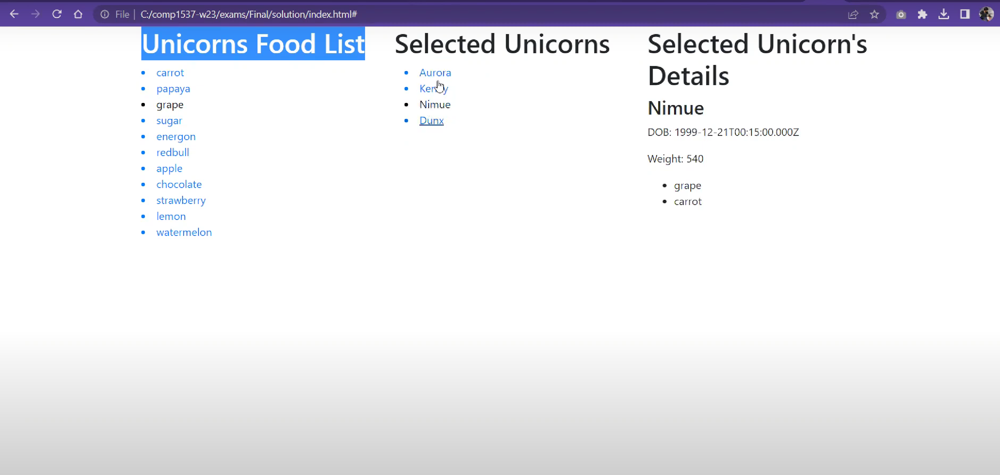
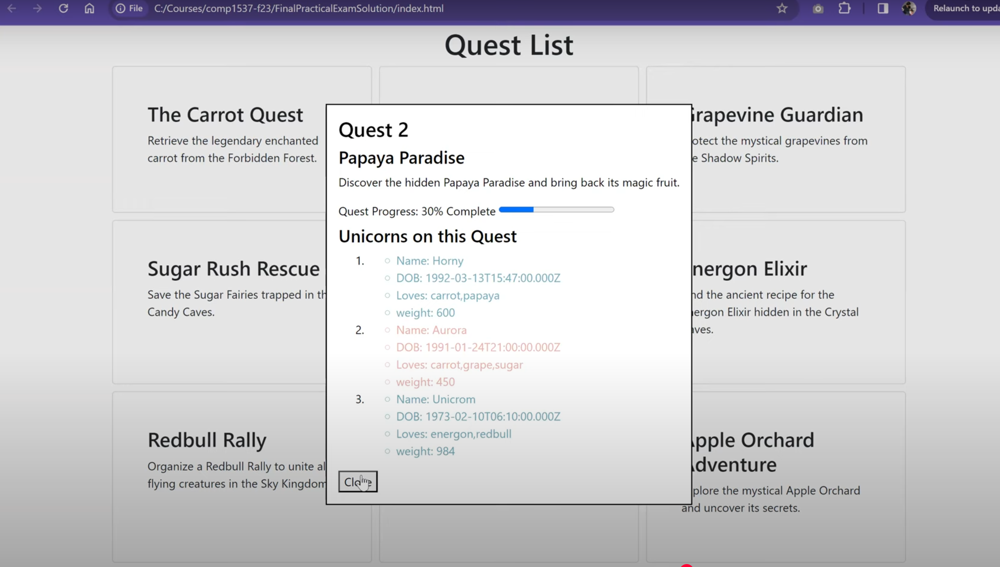
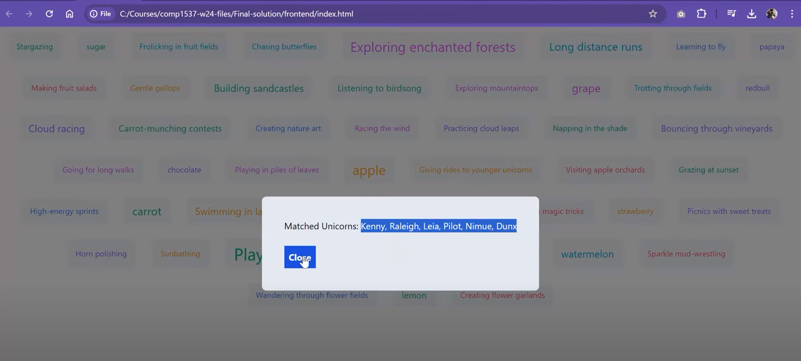
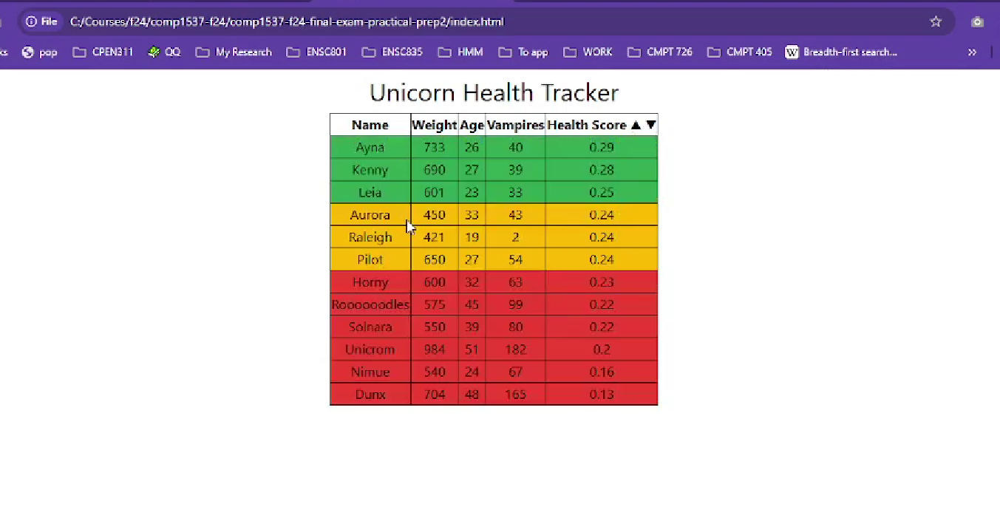

# **COMP 1537 – Course Introduction**

## **About Me**

- **Instructor:** Nabil M. Al-Rousan
- **Education:**

  - M.Sc. from UBC in Distributed Systems
  - M.Sc. from SFU in Communication Networks & Machine Learning

- **Hobbies:**

  - Running
  - Playing Video Games

- **Contact:**

  - Email: _[nabil_alrousan@bcit.ca](mailto:nabil_alrousan@bcit.ca)_
  - Preferred: **Discord**

## **Course Topics**

We will learn how to **build a full web application**:

- **Front-End Development**

  - HTML
  - CSS

- **Back-End Development**

  - JavaScript
  - Database

- **Tools, Frameworks, & Libraries**

  - VanillaJS
  - jQuery
  - JSON
  - AJAX
  - Tailwind CSS
  - Node.js
  - Express.js
  - MongoDB
  - Mongoose.js

🔗 [Course Outline](https://www.bcit.ca/outlines/20253046870/https://www.bcit.ca/outlines/20243046870/)

## **Course Materials**

- Web technologies evolve rapidly → focus on **online resources**
- Approach:

  - Interactive Learning
  - Real-World Tools
  - Self-Paced Exploration
  - Comprehensive Resources

## **Sample Midterm Exam Layouts**


## **Sample Final Exam Apps**

```js
 const unicorns = [
      {
        "_id": "641ba4876574593f27ad4323",
        "name": "Horny",
        "dob": "1992-03-13T15:47:00.000Z",
        "loves": [
          "carrot",
          "papaya"
        ],
        "weight": 600,
        "gender": "m",
        "vampires": 63,
        "vaccinated": true,
      }
      ,
      {
        "_id": "641ba4876574593f27ad4324",
        "name": "Twinkle",
        "dob": "2012-07-19T15:47:00.000Z",
        "loves": [
          "carrot",
          "celery"
        ],
        "weight": 450,
      }
```

- populates and displays information about unicorns and their preferences based on food selection.
  

- populates and displays information about a unicorn's quests.
  

- populates and displays list of unicorns-related tags. Upon clicking on a tag, the application should display a list of unicorns related to that tag.
  

- populates and displays a sortable list of unicorns based on their health status
  

## **Course Pace**


- Fast-paced, hands-on, and intensive
- Frequent practice and steady learning
- Many **weekly quizzes**

  - Each has small weight
  - Good preparation for exams

## **Good News**

- **Open-book exams and quizzes** ✨
- **Recorded lectures** for your convenience
- **Lots of quizzes** (low stakes, good practice)
